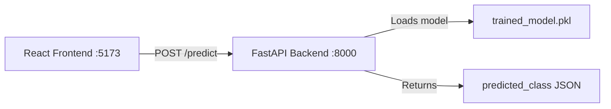

# Running the Frontend & Backend Simultaneously

> Complete guide for launching the **Environmental Sound Classification** platform locally.

---

## Architecture Overview

| Layer | Technology | Default URL | Entry Point |
|-------|-----------|-------------|-------------|
| **Backend** | FastAPI + Uvicorn | `http://localhost:8000` | [app/api.py](file:///c:/Users/prash/OneDrive/Documents/Environmental%20Sound%20Classification/app/api.py) |
| **Frontend** | React + Vite + Tailwind CSS | `http://localhost:5173` | [frontend/src/main.jsx](file:///c:/Users/prash/OneDrive/Documents/Environmental%20Sound%20Classification/frontend/src/main.jsx) |



---

## Prerequisites

Before you begin, ensure you have the following installed:

- **Python 3.10+** — [python.org](https://www.python.org/downloads/)
- **Node.js 18+** and **npm** — [nodejs.org](https://nodejs.org/)
- **Trained model files** — `models/trained_model.pkl` and `models/trained_model_scaler.pkl`
  (run `python train_model.py` first if these don't exist)

> [!IMPORTANT]
> The backend will fail to start predictions if the trained model files are missing. Run the training pipeline first:
> ```
> python train_model.py
> ```

---

## Step-by-Step Guide

You will need **two separate terminal windows** — one for the backend, one for the frontend.

---

### Terminal 1 — Backend (FastAPI)

#### 1. Open a terminal and navigate to the project root

```powershell
cd "c:\Users\prash\OneDrive\Documents\Environmental Sound Classification"
```

#### 2. Activate the virtual environment

```powershell
.\venv\Scripts\Activate
```

#### 3. Install Python dependencies (first time only)

```powershell
pip install -r requirements.txt
```

#### 4. Start the FastAPI server

```powershell
uvicorn app.api:app --reload --host 0.0.0.0 --port 8000
```

You should see output like:

```
INFO:     Uvicorn running on http://0.0.0.0:8000
INFO:     Started reloader process
INFO:     Started server process
INFO:     Waiting for application startup.
INFO:     Application startup complete.
```

#### 5. Verify the backend is running

Open your browser and visit:

- **API root** → [http://localhost:8000/docs](http://localhost:8000/docs) (Swagger UI)
- **Predict endpoint** → `POST http://localhost:8000/predict` (accepts audio file upload)

> [!TIP]
> The `--reload` flag enables hot-reloading — any changes to Python files will automatically restart the server.

---

### Terminal 2 — Frontend (React + Vite)

#### 1. Open a **new** terminal and navigate to the frontend directory

```powershell
cd "c:\Users\prash\OneDrive\Documents\Environmental Sound Classification\frontend"
```

#### 2. Install Node dependencies (first time only)

```powershell
npm install
```

#### 3. Start the Vite dev server

```powershell
npm run dev
```

You should see output like:

```
  VITE v8.x.x  ready in XXX ms

  ➜  Local:   http://localhost:5173/
  ➜  Network: http://192.168.x.x:5173/
  ➜  press h + enter to show help
```

#### 4. Open the app

Navigate to [http://localhost:5173](http://localhost:5173) in your browser.

> [!TIP]
> Vite also supports hot module replacement (HMR) — edits to `.jsx`, `.css`, and `.js` files reflect instantly without a full page reload.

---

## Quick-Start: One-Liner (PowerShell)

If you want to launch **both servers in a single command**, run this from the project root:

```powershell
Start-Process powershell -ArgumentList "-NoExit", "-Command", "cd 'c:\Users\prash\OneDrive\Documents\Environmental Sound Classification'; .\venv\Scripts\Activate; uvicorn app.api:app --reload --port 8000" ; cd frontend; npm run dev
```

This spawns the backend in a new PowerShell window and starts the frontend in the current one.

---

## Summary of Running Services

Once both terminals are running, you should have:

| Service | URL | Terminal |
|---------|-----|----------|
| FastAPI Backend | [http://localhost:8000](http://localhost:8000) | Terminal 1 |
| Swagger API Docs | [http://localhost:8000/docs](http://localhost:8000/docs) | Terminal 1 |
| React Frontend | [http://localhost:5173](http://localhost:5173) | Terminal 2 |

---

## Stopping the Servers

Press `Ctrl + C` in each terminal to gracefully shut down the respective server.

---

## Troubleshooting

### Common Issues

| Problem | Cause | Solution |
|---------|-------|----------|
| `ModuleNotFoundError: No module named 'fastapi'` | Virtual environment not activated or deps not installed | Run `.\venv\Scripts\Activate` then `pip install -r requirements.txt` |
| `FileNotFoundError: Model not found` | Model hasn't been trained yet | Run `python train_model.py` from the project root |
| `ENOENT: no such file or directory` on `npm run dev` | Missing `node_modules` | Run `npm install` in the `frontend/` directory |
| `Port 8000 already in use` | Another process is using the port | Kill the process or use `--port 8001` with uvicorn |
| `Port 5173 already in use` | Another Vite instance is running | Kill it or Vite will automatically use the next available port |
| CORS errors in browser console | Backend not running or unreachable | Ensure the backend is running on port 8000 — CORS is already configured to allow all origins |

### Checking if ports are in use

```powershell
# Check port 8000 (backend)
netstat -ano | findstr :8000

# Check port 5173 (frontend)
netstat -ano | findstr :5173
```

---

## Project File Reference

```
Environmental Sound Classification/
├── app/
│   └── api.py              ← FastAPI application (backend entry point)
├── frontend/
│   ├── src/
│   │   ├── main.jsx        ← React entry point
│   │   ├── App.jsx         ← Router & layout
│   │   └── pages/
│   │       ├── Home.jsx    ← Audio upload & classification UI
│   │       ├── Login.jsx   ← Login page
│   │       └── SignUp.jsx  ← Sign-up page
│   ├── package.json        ← Node dependencies & scripts
│   └── vite.config.js      ← Vite configuration
├── models/
│   ├── trained_model.pkl   ← Trained SVM model
│   └── trained_model_scaler.pkl ← Feature scaler
├── config.py               ← Centralized path & hyperparameter config
├── predict.py              ← Audio prediction logic
├── train_model.py          ← Model training pipeline
├── requirements.txt        ← Python dependencies
└── venv/                   ← Python virtual environment
```
